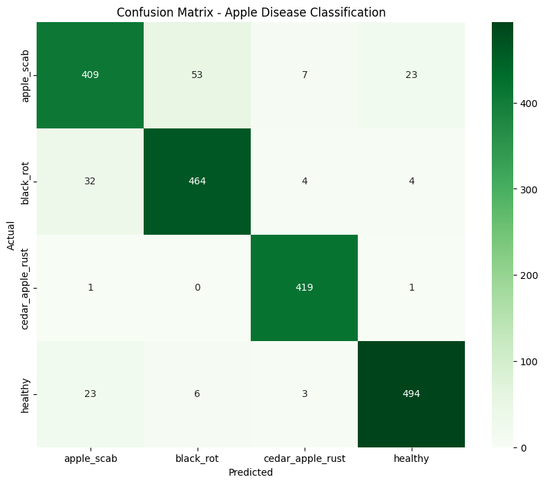
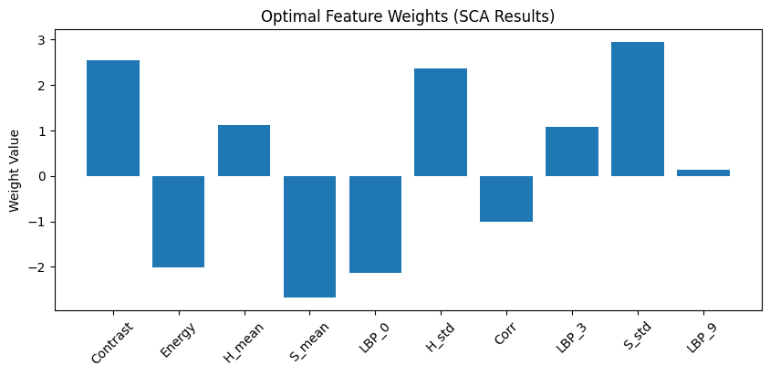

# Phân Loại Bệnh Trên Lá Táo Bằng Mô Hình Lai mRMR – SCA – SVM

Đồ án môn **MAI391** — Ứng dụng kết hợp trích xuất đặc trưng ảnh, chọn lọc đặc trưng (mRMR),
tối ưu trọng số bằng thuật toán **Sine Cosine Algorithm (SCA)** và phân loại bằng **SVM**
để nhận dạng các loại bệnh trên lá táo.

## Mục Lục
- [Tổng quan](#tổng-quan)
- [Quy trình (Pipeline)](#quy-trình-pipeline)
- [Cấu trúc thư mục](#cấu-trúc-thư-mục)
- [Cài đặt](#cài-đặt)
- [Cách chạy](#cách-chạy)
- [Kết quả](#kết-quả)

## Tổng Quan

Bài toán: phân loại ảnh lá táo thành **4 nhóm**: `apple_scab` (ghẻ táo), `black_rot` (thối đen),
`cedar_apple_rust` (gỉ sắt) và `healthy` (lá khỏe). Mô hình lai gồm các giai đoạn:

1. **Trích xuất đặc trưng** từ mỗi ảnh (kích thước chuẩn hóa 128×128):
   - **Màu sắc (HSV):** trung bình và độ lệch chuẩn của các kênh H, S, V (6 đặc trưng).
   - **Kết cấu (GLCM):** contrast, homogeneity, energy, correlation (4 đặc trưng).
   - **Kết cấu cục bộ (LBP):** histogram Local Binary Pattern (10 đặc trưng).
2. **Chuẩn hóa** dữ liệu bằng Z-score (`StandardScaler`).
3. **Chọn lọc đặc trưng (mRMR):** giữ lại 10 đặc trưng có độ liên quan cao nhất, ít trùng lặp nhất.
4. **Tối ưu trọng số (SCA):** dùng thuật toán Sine Cosine tìm bộ trọng số cho các đặc trưng
   nhằm cực đại hóa độ chính xác của SVM.
5. **Phân loại (SVM):** SVM kernel RBF trên tập đặc trưng đã được gán trọng số.

## Quy Trình (Pipeline)

```
Ảnh lá táo
   │
   ▼
Trích xuất đặc trưng  ──►  HSV (màu) + GLCM (kết cấu) + LBP  =  20 đặc trưng
   │
   ▼
Chuẩn hóa Z-score (StandardScaler)
   │
   ▼
mRMR  ──►  chọn 10 đặc trưng tốt nhất
   │
   ▼
SCA   ──►  tối ưu trọng số đặc trưng (fitness = accuracy của SVM)
   │
   ▼
SVM (RBF)  ──►  Dự đoán nhãn bệnh
```

## Cấu Trúc Thư Mục

```
AppleDisease_Hybrid_mRMR_SCA_SVM/
├── MAI391_AppleDisease_Hybrid_mRMR_SCA_SVM.ipynb   # Notebook gốc (chạy trên Google Colab)
├── apple_disease_hybrid_mrmr_sca_svm.py            # Mã nguồn tách từ notebook
├── data/                                           # Bộ dữ liệu ảnh lá táo (9.714 ảnh)
│   ├── train/                                      # 7.771 ảnh huấn luyện
│   │   ├── apple_scab/  black_rot/  cedar_apple_rust/  healthy/
│   └── test/                                       # 1.943 ảnh kiểm tra
│       └── apple_scab/  black_rot/  cedar_apple_rust/  healthy/
├── BÁO CÁO NGHIÊN CỨU.docx                         # Báo cáo đồ án
├── figures/                                        # Biểu đồ kết quả
│   ├── confusion_matrix.png
│   └── feature_weights_sca.png
├── requirements.txt                                # Thư viện cần cài
└── README.md
```

## Cài Đặt

```bash
pip install -r requirements.txt
```

> Notebook gốc được viết để chạy trên **Google Colab** (có bước `drive.mount` và giải nén dataset từ file zip).
> Khi chạy trên máy cá nhân, hãy chỉnh lại đường dẫn dataset trong phần đọc dữ liệu.

## Cách Chạy

- **Trên Google Colab:** mở `MAI391_AppleDisease_Hybrid_mRMR_SCA_SVM.ipynb`, chạy lần lượt các cell.
- **Trên máy cá nhân:** chỉnh đường dẫn dataset rồi chạy:
  ```bash
  python apple_disease_hybrid_mrmr_sca_svm.py
  ```

## Kết Quả

**Confusion Matrix** — ma trận nhầm lẫn của mô hình trên tập kiểm tra:



**Trọng số đặc trưng tối ưu (SCA)** — mức độ quan trọng của từng đặc trưng sau khi tối ưu:



---

*Đồ án môn MAI391.*
